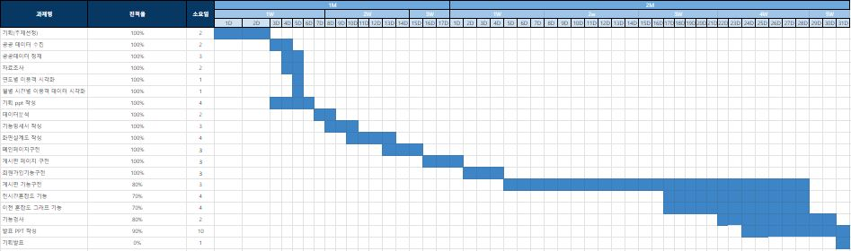

# 지하철 커뮤니티 Bartro

---

- **기간** : 22.07.21 ~ 22.08.26
- **인원** : 4명
- **[보고서](./%EC%A7%80%ED%95%98%EC%B2%A0_%EC%BB%A4%EB%AE%A4%EB%8B%88%ED%8B%B0_Bartro.pdf)**
- **개발 도구**
    - `STS4`
        - `Java`
        - `Springboot`
        - `Gradle Build Tool`
        - `Mybatis`
        - `Log4JDBC`
        - `lombok`
        - `Thymeleaf`
    - `VSCode`
    - `DBeaver`
        - `MySQL`
    - `GitHub`
    - `Sourcetree`

# 프로젝트 목적

---

- 실시간으로 지하철 정보 공유를 할 수 있는 공간을 제공한다.
- 지하철에 관한 문제제기와 해결방안 의견을 공유 할 수 있는 커뮤니티 사이트를 제공한다.

# 팀원 및 역할 분담

---

- 팀원 : 김민성, 남재욱, 정슬기, 한정인
- 김민성
    - 게시판
    - 댓글
    - 크롤링
    - 메인페이지
- 남재욱
    - 데이터 분석
    - 게시판
    - PPT
- 정슬기 - 팀장
    - 게시판
    - CSS
    - PPT
- 한정인
    - 로그인/로그아웃
    - 회원가입
    - 아이디찾기/비밀번호 찾기
    - 마이페이지
    - 게시판 및 댓글 구조 수정

# 프로젝트 수행 과정

---

- 전체 수행 기간 : 2022.07.21 ~ 2022.08.26

# 기능명세서

- **[링크](https://docs.google.com/spreadsheets/d/1SEq3V0YTZoTBp5HJSqfM4Xju8Vn0xkl4luxKgBTrW3U/edit#gid=1788300613)** : https://docs.google.com/spreadsheets/d/1SEq3V0YTZoTBp5HJSqfM4Xju8Vn0xkl4luxKgBTrW3U/edit#gid=1788300613

# DDL

- **[DDL](./DDL.md)**

# 한계점 및 시행착오

---
- **한계점**
    - 답글 기능 미구현
    - 데이터 분석 페이지 미구현
- **시행착오**
    - 첫 협업이라 pull, push가 제대로 안될 때가 꽤 있었음 -> 팀원들끼리 서로 소통하고 어떤 부분 작업을 할 것인지 미리 맣해서 해결
    - 잘 실행되던 페이지가 갑자기 작동되지 않을 때가 있음 -> css 부분을 변경하면서 id 값을 바꾸면서 생긴 일이라서 다시 맞춰 줌